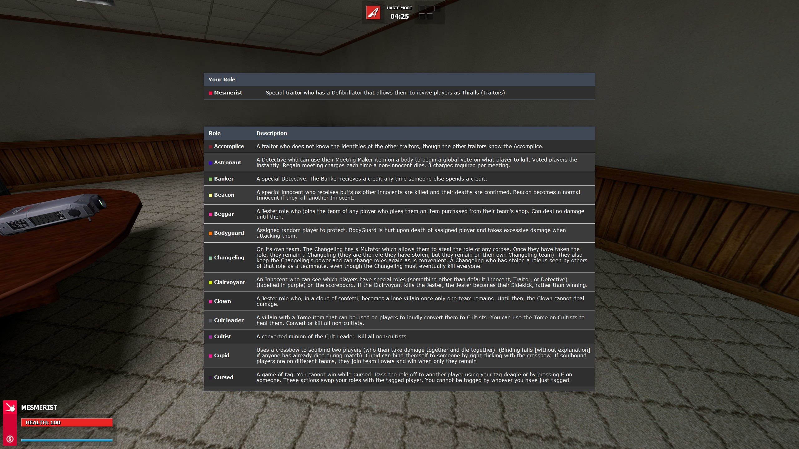

# TTT2 Role Descriptions Menu

This addon adds a menu to the game which displays descriptions for the roles in use, configurable by the server. Your current role and corresponding description is at the top. By default, holding `left alt` should bring up the menu. This can be rebound in the TTT F1 menu.

The server host can update role descriptions in the [roles data file](data/roles.json). This file is automatically sent to clients when they join. It can be resent to all clients at any time with the `reload_role_menu` concommand.

